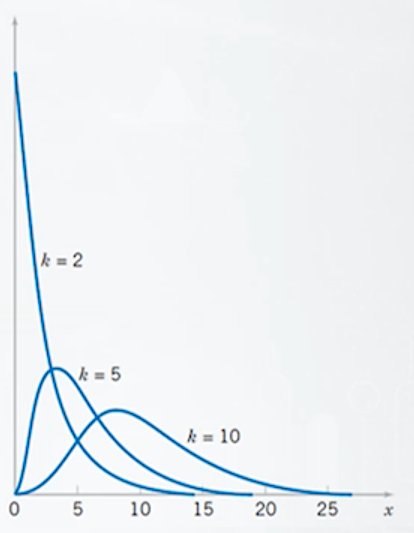

## 카이제곱분포, t분포, f분포

### 카이제곱분포의 정의

- $Z_1, Z_2, ..., Z_k$가 k개의 서로 독립인 표준정규 확률변수
$Z \text{\textasciitilde} N[0,1], i = 1,2, ..., k$ 라고 할 때,
$X = {Z_1}^2 + {Z_2}^2 + … + {Z_k}^2$가 따르는 분포를
자유도가 k인 카이제곱분포라고 정의함
    
    $f(x)=\dfrac {1} {\Gamma(\dfrac {1} {2})2^{k/2}} x^{k/2 - 1}e^{-x/2}, 0 < x < \infin$
    
    - 이 경우 $X \text{\textasciitilde} \chi^2[k]$라고 함. k는 자유도.

### 카이제곱 분포의 특성치

- $X \text{\textasciitilde} \chi^2[k]$인 경우
    - $E[X] = k$
    - $V[X] = 2k$

### 카이제곱 분포 확률밀도함수 개형

- 오른쪽 꼬리가 길게 늘어진 비대칭 형태임.
    
    
    
    - 자유도가 커질수록 종모양에 가까워짐

### 카이제곱 확률변수의 $(1-\alpha)$분위수 : ${\chi^2}_{\alpha,k}$

- $X \text{\textasciitilde} \chi^2[k]$일 때, $P[X > c] = \alpha$를 만족하는
X의 $(1-\alpha)$분위수 c를 ${\chi^2}_{\alpha,k}$으로 표기함

### t분포의 정의

- Z가 표준정규 확률변수 $Z \text{\textasciitilde} N[0,1]$이며, U가 자유도 k인
카이제곱 확률변수  $U \text{\textasciitilde} \chi^2[k]$이며, Z와 U는 서로 독립이라고 할 때,
$X = \dfrac {Z} {\sqrt {U/k}}$가 따르는 분포를 자유도가 k인 t분포라고 정의함.
$f(x) = \dfrac {\Gamma \big( {\dfrac {k+1} {2}}\big)} {\Gamma \big( {\dfrac {k} {2}}\big)} \dfrac {1} {\sqrt {k\pi}} \dfrac {1} {\Big( 1 + \dfrac {x^2} {k} \Big)^{(k+1)/2}}, -\infin < x < \infin$
    - 이 경우 $X \text{\textasciitilde} t[k]$라고 함.

### t분포의 특성치

- $X \text{\textasciitilde} t[k]$인 경우
    - $E[X] = 0$
    - $V[X] = \dfrac {k} {k-2}$ (단, k > 2), 분산이 표준정규분포보다 조금 큼

### t분포 확률밀도함수 개형

- $X \text{\textasciitilde} t[k]$인 경우
    - 가운데 0을 중심으로 대칭인 종모양의 분포
    - 표준정규분포보다 꼬리가 두꺼움
    - 자유도 k가 커짐에 따라 산포가 줄어들어 표준정규분포로 수렴함
    
    
    

### t확률변수의 $(1-\alpha)$분위수 : $t_{\alpha,k}$

- $X \text{\textasciitilde} t[k]$일 때, $P[X>c] = \alpha$를 만족하는
$X$의 $(1-\alpha)$ 분위수 c를 $t_{\alpha,k}$로 표기함

### F분포의 정의

- U가 자유도가 $k_1$인 카이제곱 확률변수 $U \text{\textasciitilde} \chi^2[k_1]$이며, V가 자유도가 
$k_2$인 카이제곱 확률변수 $V \text{\textasciitilde} \chi^2[k_2]$이고, U와 V는 서로 독립이라고 할 때,
    
    $X = \dfrac {U/k1} {V/k2}$가 따르는 분포를 자유도가 $k_1, k_2$인 F분포라고 정의함.
    
    $f(x) = \dfrac {\Gamma \Big( \dfrac {k_1 + k_2} {2} \Big)} {\Gamma \Big( \dfrac {k_1} {2} \Big) \Gamma \Big( \dfrac {k_2} {2} \Big)} {\Big(\dfrac {k_1} {k_2}\Big)}^{k_1/2} x^{k_1/2 - 1} {\bigg( 1 + \dfrac {k_1} {k_2} x \bigg)}^{-(k_1 + k_2)/2}, 0 < x < \infin$
    
    - 이 경우 $X \text{\textasciitilde} F[k_1, k_2]$라고 함

### F분포의 특성치

- $X \text{\textasciitilde} F[k_1, k_2]$인 경우
    - $E[X] = \dfrac {k_2} {k_2 - 2}$
    - $V[X] = \dfrac {2{k_2}^2(k_1 + k_2 - 2)} {k_1 (k_2 - 2)^2 (k_2 - 4)}$

### F분포 확률밀도함수 개형

- 카이제곱 분포처럼 오른쪽으로 치우친 비대칭 구조임.
    
    
    

### F확률변수의 $(1-\alpha)$분위수 : $F_{\alpha, k_1, k_2}$

- $X \text{\textasciitilde} F[k_1, k_2]$일 때, $P[X > c] = \alpha$를 만족하는
X의 $(1-\alpha)$ 분위수 c를 $F_{\alpha, k_1, k_2}$으로 표기함.

정리

- 카이제곱분포 → 표준정규들의 제곱합이 가지는 분포
- t분포 → 표준정규에 평균이 가지는 분포
- F분포 → 2개의 카이제곱분포의 비율이 만들어내는 분포
